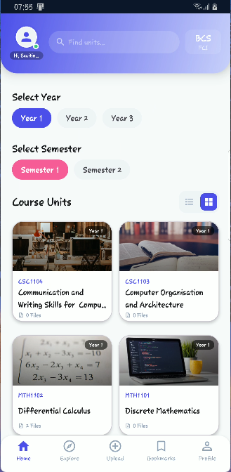
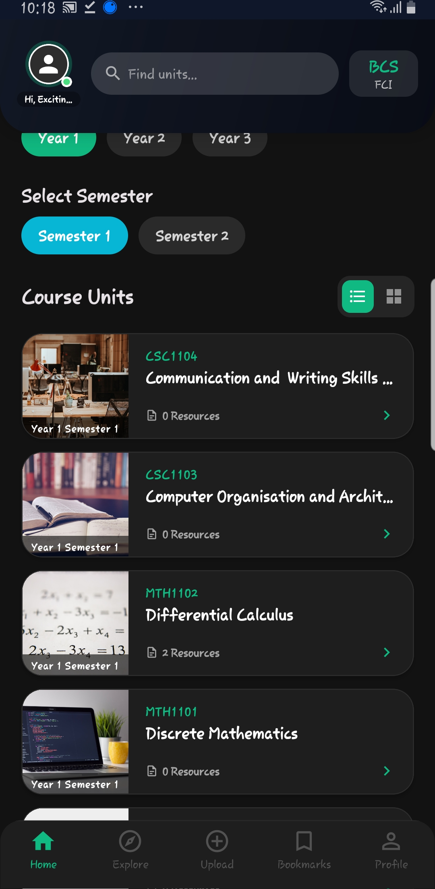
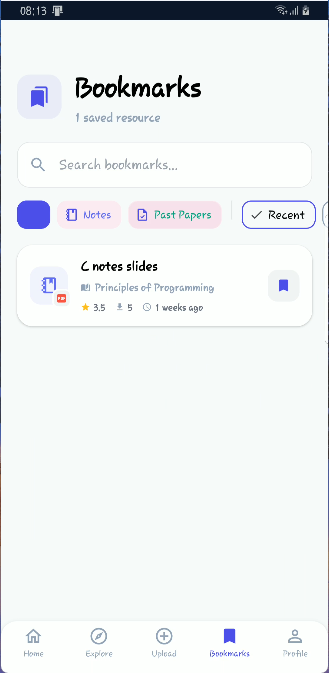

# 📚 CampusVault

<div align="center">


### 🎓 Your Ultimate Academic Resource Hub
**Share. Learn. Succeed.**

[](https://reactnative.dev/)
[](https://reactnative.dev/)
[](LICENSE)
[]()

</div>

## ✨ Overview

CampusVault is a comprehensive React Native application designed to revolutionize academic resource sharing within university communities. Students can effortlessly share, discover, and organize course materials, lecture notes, past papers, and study resources—all in one intuitive platform.

### 🔄 **Migration Notice**
> **Currently migrating from native Android to React Native for cross-platform compatibility. This repository contains the React Native implementation.**

## 📱 Features

### 🎯 **Core Features**
- **📖 Resource Sharing** – Upload and share course materials, notes, and past papers
- **🔍 Smart Discovery** – Browse resources by faculty, program, or course unit
- **⭐ Bookmark System** – Save important resources for quick access
- **👤 User Profiles** – Personalized dashboards and contribution tracking
- **📊 Preview System** – Preview resources before downloading

### 🚀 **Coming Soon**
- [ ] Real-time notifications
- [ ] Advanced search filters
- [ ] Offline access to bookmarked content
- [ ] Collaborative study groups
- [ ] Resource rating system

## 🎨 Screenshots

<div align="center">

### 📱 Application Preview

| Home Screen | Explore Resources | Course Details |
|-------------|------------------|----------------|
|    |  |    |

| Faculty View | Resource Preview | User Profile |
|--------------|------------------|--------------|
|  |  |  |

| Bookmark Manager | Program Overview | Upload Interface |
|------------------|------------------|------------------|
|  |  |  |

</div>

## 🚀 Quick Start

### 📋 Prerequisites

Ensure you have the following installed:
- **Node.js** (v16 or newer)
- **npm** or **yarn**
- **Java JDK 11**
- **Android Studio** (for Android development)
- **Xcode** (for iOS development, macOS only)

### ⚙️ Installation

1. **Clone the repository**
```bash
git clone https://github.com/AstronDaniel/CampusVault.git
cd CampusVault
```

2. **Install dependencies**
```bash
npm install
# or
yarn install
```

3. **Install iOS dependencies** (macOS only)
```bash
cd ios && pod install && cd ..
```

### ▶️ Running the App

#### **Start Metro Bundler**
```bash
npm start
# or
yarn start
```

#### **Android**
```bash
npm run android
# or
yarn android
```

#### **iOS** (macOS only)
```bash
npm run ios
# or
yarn ios
```

## 🏗️ Project Structure

```
CampusVault/
├── android/          # Android native code
├── ios/             # iOS native code
├── src/
│   ├── assets/      # Images, fonts, etc.
│   ├── components/  # Reusable components
│   ├── screens/     # App screens
│   ├── navigation/  # Navigation configuration
│   ├── services/    # API services
│   ├── utils/       # Helper functions
│   └── types/       # TypeScript definitions
├── App.tsx          # Root component
└── package.json     # Dependencies
```

## 📦 Dependencies

### 🎯 Core Libraries
- **React Navigation** – App navigation and routing
- **React Native Reanimated** – Smooth animations
- **React Native Vector Icons** – Icon library
- **AsyncStorage** – Local data persistence
- **Axios** – HTTP client for API calls

### 🛠️ Development Tools
- **TypeScript** – Type safety
- **ESLint & Prettier** – Code quality
- **React Native Debugger** – Debugging tool

## 🔧 Configuration

### Environment Variables
Create a `.env` file in the root directory:
```env
API_BASE_URL=your_api_url_here
GOOGLE_API_KEY=your_google_api_key
ENVIRONMENT=development
```

## 🤝 Contributing

We welcome contributions! Please follow these steps:

1. Fork the repository
2. Create a feature branch (`git checkout -b feature/AmazingFeature`)
3. Commit your changes (`git commit -m 'Add some AmazingFeature'`)
4. Push to the branch (`git push origin feature/AmazingFeature`)
5. Open a Pull Request

### 📝 Code Style
- Follow the existing code style
- Write meaningful commit messages
- Add comments for complex logic
- Update documentation as needed

## 🐛 Troubleshooting

| Issue | Solution |
|-------|----------|
| Metro bundler won't start | Clear cache: `npm start -- --reset-cache` |
| Android build fails | Clean gradle: `cd android && ./gradlew clean` |
| iOS build fails | Clean Xcode build folder & reinstall pods |
| App crashes on start | Check native dependencies are properly linked |

## 📚 Learning Resources

- [React Native Documentation](https://reactnative.dev/docs/getting-started)
- [React Navigation Docs](https://reactnavigation.org/docs/getting-started/)
- [TypeScript Handbook](https://www.typescriptlang.org/docs/)
- [Expo Documentation](https://docs.expo.dev/)

## 📄 License

This project is licensed under the MIT License - see the [LICENSE](LICENSE) file for details.

## 🙏 Acknowledgments

- University students worldwide for inspiration
- React Native community for amazing tools
- Contributors and testers
- Unsplash for placeholder images

---

<div align="center">

### 💬 Connect With Us


[](https://github.com/AstronDaniel/CampusVault/issues)

**Made with ❤️ for students everywhere**

</div>