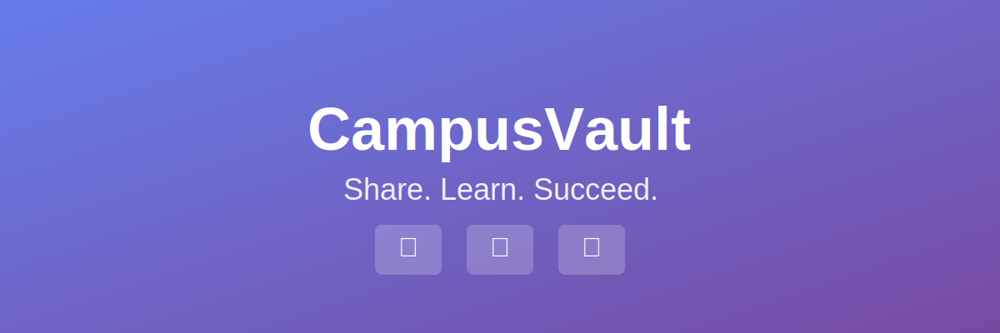
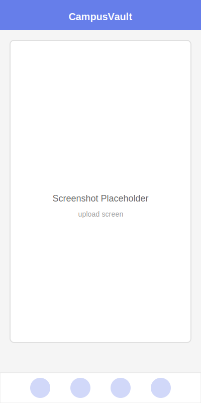
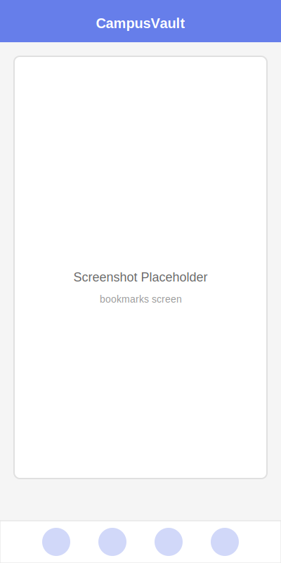
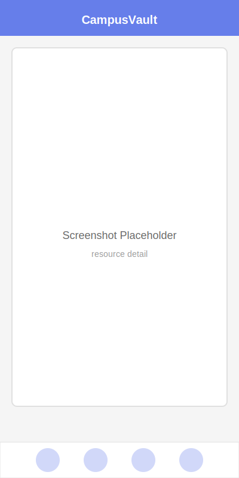

# CampusVault 📚




**CampusVault** - Share. Learn. Succeed.

A comprehensive Android application designed to help university students discover, share, and collaborate on educational resources. CampusVault creates a centralized platform where students can upload study materials, browse resources shared by peers, and build their academic success together.

## 📱 Features

### Core Functionality
- **🔍 Resource Discovery**: Browse through thousands of study materials, notes, and resources shared by students from your university
- **📤 Content Sharing**: Upload your notes, assignments, and study materials to help other students
- **🔖 Smart Bookmarking**: Save and organize your favorite resources for quick access
- **👥 User Profiles**: Personalized profiles to track your contributions and saved resources
- **🏛️ Faculty & Program Exploration**: Discover resources organized by faculty and academic programs
- **📊 Course Unit Management**: Browse resources organized by specific course units

### Advanced Features
- **🔐 Secure Authentication**: Email-based authentication with secure password requirements
- **🌓 Dark Mode Support**: Eye-friendly interface that adapts to your preference
- **📥 Offline Access**: Download and access resources even without internet connection
- **🔄 Auto-Sync**: Automatic synchronization of resources in the background
- **📱 Material Design**: Modern, intuitive UI following Material Design 3 guidelines
- **🔔 Update Notifications**: Automatic update checking to keep the app current
- **📄 PDF Preview**: In-app PDF viewer for quick document preview
- **🖼️ Image Cropping**: Built-in image cropping for profile pictures and uploads

## 🛠️ Tech Stack

### Architecture & Design Patterns
- **MVVM Architecture**: Clean separation of concerns with ViewModel and LiveData
- **Repository Pattern**: Abstracted data layer for flexible data source management
- **Dependency Injection**: Hilt for efficient dependency management

### Core Libraries & Frameworks
- **Language**: Java
- **Min SDK**: 24 (Android 7.0)
- **Target SDK**: 36 (Android 14+)

### Key Dependencies
- **UI Components**:
  - Material Design Components
  - ViewBinding & DataBinding
  - Shimmer Effect for loading states
  - Lottie for smooth animations
  
- **Networking**:
  - Retrofit for REST API communication
  - OkHttp for HTTP client
  - Gson for JSON parsing
  - RxJava for reactive programming

- **Image Loading**:
  - Glide for efficient image loading and caching
  - Android Image Cropper for image editing

- **Database**:
  - Room Persistence Library for local data storage
  - RxJava integration for reactive queries

- **Background Processing**:
  - WorkManager for reliable background tasks

- **Navigation**:
  - Jetpack Navigation Component

- **Security**:
  - Jetpack Security Crypto for secure data storage

## 📸 Screenshots

| Home | Explore | Upload |
|------|---------|--------|
|  |  |  |

| Bookmarks | Profile | Resource Detail |
|-----------|---------|-----------------|
|  |  |  |

## 🚀 Getting Started

### Prerequisites
- Android Studio Hedgehog (2023.1.1) or later
- JDK 11 or later
- Android SDK with API level 36
- Gradle 8.0+

### Installation

1. **Clone the repository**
   ```bash
   git clone https://github.com/AstronDaniel/CampusVault.git
   cd CampusVault
   ```

2. **Open in Android Studio**
   - Launch Android Studio
   - Select "Open an Existing Project"
   - Navigate to the cloned repository and select it

3. **Sync Gradle**
   - Android Studio will automatically prompt to sync Gradle
   - Wait for the sync to complete

4. **Configure Backend (Optional)**
   - Update API endpoints in your network configuration if you have a custom backend
   - Default configuration uses the production API

### Building the App

#### Debug Build
```bash
./gradlew assembleDebug
```
The APK will be generated at `app/build/outputs/apk/debug/app-debug.apk`

#### Release Build
```bash
./gradlew assembleRelease
```
The APK will be generated at `app/build/outputs/apk/release/app-release.apk`

### Running on Device/Emulator

1. **Using Android Studio**:
   - Connect your Android device or start an emulator
   - Click the "Run" button (▶) or press `Shift + F10`

2. **Using Command Line**:
   ```bash
   ./gradlew installDebug
   ```

## 📱 App Structure

```
app/
├── src/
│   ├── main/
│   │   ├── java/com/example/campusvault/
│   │   │   ├── data/              # Data layer (repositories, models)
│   │   │   ├── di/                # Dependency injection modules
│   │   │   ├── ui/                # UI layer
│   │   │   │   ├── auth/          # Authentication screens
│   │   │   │   ├── main/          # Main app screens
│   │   │   │   │   ├── home/      # Home feed
│   │   │   │   │   ├── explore/   # Faculty/Program exploration
│   │   │   │   │   ├── upload/    # Resource upload
│   │   │   │   │   ├── bookmarks/ # Saved resources
│   │   │   │   │   └── profile/   # User profile
│   │   │   │   ├── onboarding/    # First-time user experience
│   │   │   │   ├── splash/        # Splash screen
│   │   │   │   └── dialogs/       # Reusable dialogs
│   │   │   └── utils/             # Utility classes
│   │   └── res/                   # Resources (layouts, drawables, etc.)
│   └── test/                      # Unit tests
└── build.gradle.kts               # App-level build configuration
```

## 🔒 Permissions

CampusVault requires the following permissions:

- **Internet Access**: For API communication and resource downloads
- **Network State**: To check connectivity before operations
- **Storage Access**: For uploading and downloading files
  - `READ_EXTERNAL_STORAGE` (API < 33)
  - `WRITE_EXTERNAL_STORAGE` (API < 33)
  - `READ_MEDIA_IMAGES`, `READ_MEDIA_VIDEO`, `READ_MEDIA_AUDIO` (API 33+)
- **Install Packages**: For in-app updates

## 🤝 Contributing

Contributions are welcome! Here's how you can help:

1. **Fork the repository**
2. **Create a feature branch**
   ```bash
   git checkout -b feature/your-feature-name
   ```
3. **Commit your changes**
   ```bash
   git commit -m "Add: your feature description"
   ```
4. **Push to your branch**
   ```bash
   git push origin feature/your-feature-name
   ```
5. **Open a Pull Request**

### Code Style Guidelines
- Follow standard Java coding conventions
- Use meaningful variable and method names
- Add comments for complex logic
- Ensure all new features are properly tested
- Keep the UI consistent with Material Design guidelines

## 📄 License

This project is licensed under the MIT License - see the [LICENSE](LICENSE) file for details.

## 👨‍💻 Developer

**Daniel Astron**
- GitHub: [@AstronDaniel](https://github.com/AstronDaniel)

## 🙏 Acknowledgments

- Material Design icons and components
- All contributors who help improve CampusVault
- The Android developer community

## 📞 Support

If you encounter any issues or have questions:
- Open an [Issue](https://github.com/AstronDaniel/CampusVault/issues)
- Check existing issues for solutions
- Contact the developer through GitHub

## 🗺️ Roadmap

- [ ] Push notifications for new resources
- [ ] Advanced search and filtering
- [ ] Resource rating and reviews
- [ ] Direct messaging between students
- [ ] Study group formation
- [ ] Integration with university LMS
- [ ] Multi-language support
- [ ] Web version

---

**Made with ❤️ for students, by students**
